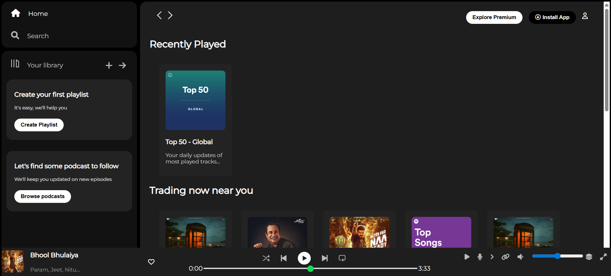
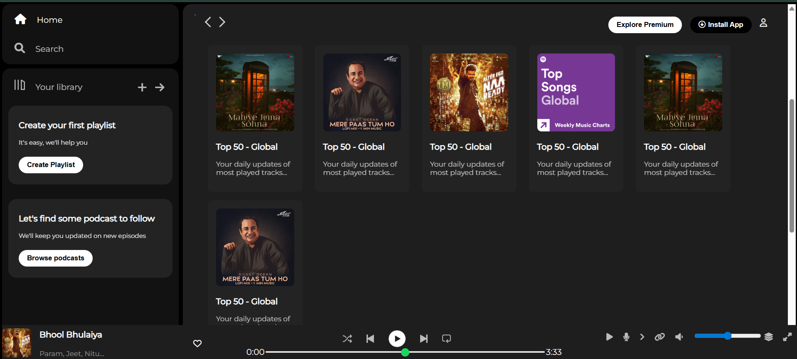

# Spotify Clone

This project is a simple UI clone of Spotify, created to practice HTML and CSS skills.
This project is a front-end replica of the Spotify web application's user interface, meticulously crafted as a hands-on exercise to solidify and showcase proficiency in HTML and CSS. The primary objective was to deconstruct a professional, real-world design and rebuild it from the ground up, focusing purely on the visual presentation and layout.

It faithfully recreates the familiar Spotify layout, including the main navigation sidebar, the central content area displaying playlists and albums, and the static music control bar at the bottom of the page. The process involved structuring the content semantically with HTML and then applying a wide range of CSS properties to style every element, from button placement and iconography to typography and color schemes, in order to match the original design as closely as possible. This project serves as a static visual clone and does not include any backend functionality for music playback or user interaction.

## Demo

Here are some screenshots of the project:

